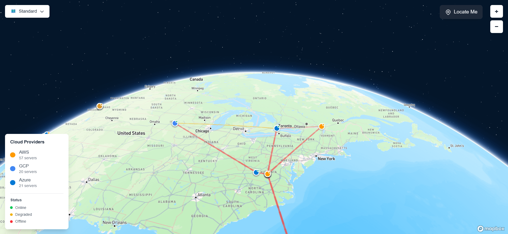
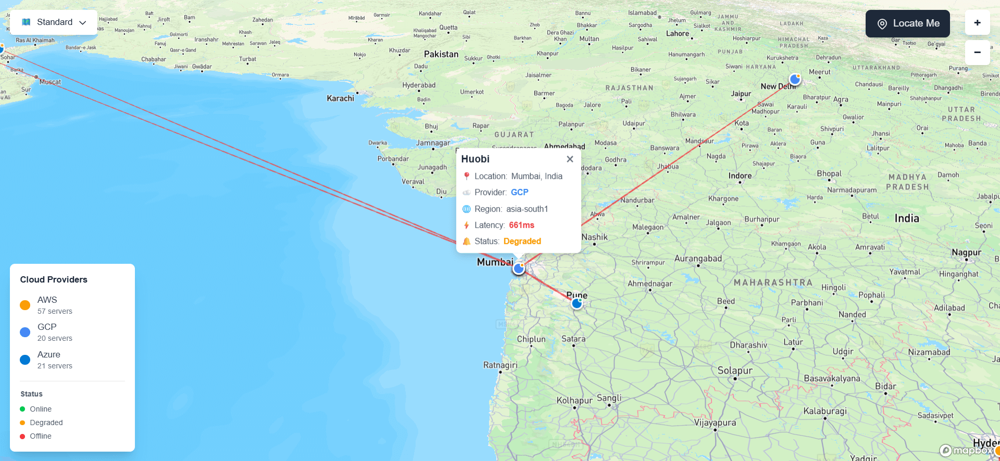

# 🌐 Latency Topology Visualizer

<div align="center">


**A real-time 3D interactive visualization of cryptocurrency exchange server latency and network topology across global cloud infrastructure.**

</div>

## 📖 Overview

The Latency Topology Visualizer is an advanced web application that provides real-time visualization of cryptocurrency exchange server infrastructure distributed across AWS, GCP, and Azure cloud platforms. It displays network latency through color-coded animated connection lines and allows users to explore the global distribution of exchange servers on an interactive 3D globe.

### 🎯 Key Highlights

- **Real-time Latency Monitoring**: Visualize network latency between 70+ exchange servers globally
- **Multi-Cloud Support**: Covers AWS, GCP, and Azure infrastructure
- **Interactive 3D Globe**: Powered by Mapbox GL JS with smooth animations
- **Dynamic Connections**: Color-coded lines (green/yellow/red) representing latency levels
- **Pulse Animations**: Flowing pulse effects showing data transmission
- **Auto-refresh**: Updates every 5 seconds with latest latency data

---

## ✨ Features

### 🗺️ **Interactive 3D Globe Visualization**
- **Globe Projection**: Realistic 3D globe view with smooth rotation
- **Three Map Styles**: Standard, Light, and Dark modes
- **Zoom Controls**: Intuitive zoom in/out functionality
- **Smooth Animations**: Fluid transitions and camera movements

### 📍 **Server & Location Tracking**
- **70+ Exchange Servers**: Covers major crypto exchanges (Binance, Coinbase, Bybit, OKX, etc.)
- **Global Coverage**: Servers across North America, Europe, Asia, Middle East, Africa, and Oceania
- **User Location**: "Locate Me" button to find and display your position
- **Interactive Markers**: Click on any server to view detailed information

### ⚡ **Real-Time Latency Visualization**
- **Color-Coded Lines**:
  - 🟢 **Green**: Low latency (< 100ms)
  - 🟡 **Yellow**: Medium latency (100-300ms)
  - 🔴 **Red**: High latency (> 300ms)
- **Pulse Animation**: Flowing animations showing data transmission
- **Mesh Network**: Each server connects to 4 nearest neighbors
- **Auto-Update**: Refreshes every 5 seconds

### 🎛️ **Interactive Controls**
- **Map Styles**: Switch between Standard, Light, and Dark themes
- **Zoom Controls**: Custom zoom in/out buttons
- **Locate Me**: Manual geolocation with smooth camera movement
- **Server Popups**: Detailed info on click (Exchange, Provider, Region, City, Latency)

### 📊 **Information Display**
- **Legend**: Real-time count of servers by cloud provider (AWS/GCP/Azure)
- **Color Guide**: Latency range indicators
- **Loading States**: Beautiful loading indicators during data fetch

---

## 🚀 Demo

### Screenshots

#### Main Globe View with Connections


#### Server Details Popup


#### Dark Mode


---

## 🛠️ Installation

### Prerequisites

Before you begin, ensure you have the following installed:
- **Node.js** (v18 or higher)
- **npm** or **yarn** or **pnpm**
- **Mapbox Access Token** (free tier available at [mapbox.com](https://mapbox.com))

### Step-by-Step Setup

1. **Clone the repository**
   ```bash
   git clone https://github.com/rtewari056/latency-topology-visualizer.git
   cd latency-topology-visualizer
   ```

2. **Install dependencies**
   ```bash
   npm install
   # or
   yarn install
   # or
   pnpm install
   ```

3. **Set up environment variables**
   
   Create a `.env.local` file in the root directory:
   ```env
   NEXT_PUBLIC_MAPBOX_TOKEN=your_mapbox_access_token_here
   ```

   **To get a Mapbox token:**
   - Go to [mapbox.com](https://mapbox.com)
   - Sign up for a free account
   - Navigate to your [Account Dashboard](https://account.mapbox.com/)
   - Copy your default public token or create a new one

4. **Run the development server**
   ```bash
   npm run dev
   # or
   yarn dev
   # or
   pnpm dev
   ```

5. **Open your browser**
   
   Navigate to [http://localhost:3000](http://localhost:3000)

### Build for Production

```bash
npm run build
npm start
```

---

## 💻 Usage

### Basic Navigation

1. **Explore the Globe**
   - Click and drag to rotate the globe
   - Scroll to zoom in/out
   - Use zoom controls (+ / -) in the top-right corner

2. **View Server Details**
   - Click on any server marker (colored dots)
   - Popup displays exchange name, cloud provider, region, city, and latency

3. **Find Your Location**
   - Click the "Locate Me" button (top-right)
   - Allow location permission when prompted
   - Globe flies to your location with a red marker

4. **Change Map Style**
   - Click the style selector dropdown (top-right)
   - Choose between Standard, Light, or Dark themes

### Understanding the Visualization

- **Server Markers**: Colored dots representing exchange servers
- **Connection Lines**: Lines between servers showing network topology
  - Line color indicates latency (green = fast, red = slow)
  - Animated pulse effect shows data flow direction
- **Legend**: Bottom-left shows server count by cloud provider

---

## 🏗️ Architecture

### Project Structure

```
latency-topology-visualizer/
├── app/                          # Next.js 15+ App Router
│   ├── layout.tsx               # Root layout with metadata
│   ├── page.tsx                 # Main application page
│   └── globals.css              # Global styles & animations
├── components/                   # React components
│   ├── location-marker.tsx      # User location marker
│   ├── exchange-server-markers.tsx  # Server markers with popups
│   ├── latency-connections-simple.tsx  # Connection lines & animations
│   └── map/                     # Map control components
│       ├── map-zoom-controls.tsx
│       ├── map-theme-toggle.tsx
│       ├── map-legend.tsx
│       └── locate-me-button.tsx
├── context/                      # React Context for state management
│   ├── map-context.tsx          # Map instance & center state
│   └── theme-context.tsx        # Theme (map style) state
├── lib/                          # Core business logic
│   ├── api/
│   │   └── real-time-exchange-data.ts  # Fetch & process server data
│   ├── data/
│   │   ├── region-endpoints.ts         # Server endpoint definitions
│   │   └── exchange-region-mapping.ts  # Exchange-to-region mappings
│   ├── services/
│   │   └── latency-measurement.ts      # Latency measurement logic
│   ├── types/
│   │   └── exchange-server.ts          # TypeScript type definitions
│   └── mapbox/
│       ├── provider.tsx         # Mapbox initialization
│       └── utils.ts             # Map utilities & helpers
├── public/                       # Static assets
├── .env.local                   # Environment variables (create this)
├── package.json                 # Dependencies
├── tsconfig.json                # TypeScript configuration
└── README.md                    # This file
```

### Tech Stack

#### Core Framework
- **[Next.js 16.0.1](https://nextjs.org/)** - React framework with App Router
- **[React 19.2.0](https://react.dev/)** - UI library
- **[TypeScript 5.0+](https://www.typescriptlang.org/)** - Type safety

#### Mapping & Visualization
- **[Mapbox GL JS 3.16.0](https://docs.mapbox.com/mapbox-gl-js/)** - 3D globe rendering and interactions
- **Custom Shaders** - For connection line animations

#### Styling
- **[Tailwind CSS 4](https://tailwindcss.com/)** - Utility-first CSS framework
- **Custom CSS** - Animations and Mapbox popup styling

#### State Management
- **React Context API** - Global state for map instance and theme

#### Development Tools
- **[ESLint](https://eslint.org/)** - Code linting
- **[@vercel/analytics](https://vercel.com/analytics)** - Web analytics

### Data Flow

```
┌──────────────────────────────────────────────────────────┐
│           User Opens Application                         │
└─────────────────────┬────────────────────────────────────┘
                      │
                      ▼
┌──────────────────────────────────────────────────────────┐
│  MapboxProvider: Initialize map with default location    │
└─────────────────────┬────────────────────────────────────┘
                      │
                      ▼
┌──────────────────────────────────────────────────────────┐
│  Fetch Real-Time Exchange Data                           │
│  • Load 70+ server endpoints                             │
│  • Measure latency to each endpoint                      │
│  • Calculate average latency                             │
└─────────────────────┬────────────────────────────────────┘
                      │
                      ▼
┌──────────────────────────────────────────────────────────┐
│  Render Components                                       │
│  ├─ ExchangeServerMarkers: Plot servers on globe         │
│  ├─ SimpleConnections: Draw connection lines             │
│  │   └─ Find 4 nearest neighbors for each server         │
│  │   └─ Color by latency (green/yellow/red)              │
│  │   └─ Start pulse animation                            │
│  └─ Map Controls: Zoom, style, locate buttons            │
└─────────────────────┬────────────────────────────────────┘
                      │
                      ▼
┌──────────────────────────────────────────────────────────┐
│  Auto-Refresh Loop (every 5 seconds)                     │
│  └─ Re-fetch data → Update markers → Update connections  │
└──────────────────────────────────────────────────────────┘
```

### Key Algorithms

#### Nearest Neighbor Connection
```typescript
// Find 4 nearest servers for mesh network
for each server:
  calculate distance to all other servers
  sort by distance (ascending)
  connect to 4 nearest servers
  avoid duplicate connections (A↔B only once)
```

#### Latency Color Calculation
```typescript
function getLatencyColor(latencyMs: number): string {
  if (latencyMs < 100)  return '#10b981';  // Green
  if (latencyMs < 300)  return '#eab308';  // Yellow
  return '#ef4444';                         // Red
}
```

## 🔧 Configuration

### Environment Variables

| Variable | Required | Description |
|----------|----------|-------------|
| `NEXT_PUBLIC_MAPBOX_TOKEN` | ✅ Yes | Your Mapbox public access token |

### Customization

#### Add More Server Regions

Edit `lib/data/region-endpoints.ts`:

```typescript
{
  region: 'your-region-id',
  endpoint: 'https://your-endpoint.com',
  provider: 'AWS', // or 'GCP' or 'Azure'
  location: {
    city: 'City Name',
    country: 'Country',
    latitude: 12.3456,
    longitude: 78.9012,
  },
}
```

Then map to exchanges in `lib/data/exchange-region-mapping.ts`:

```typescript
{
  exchange: 'ExchangeName',
  regions: [
    { region: 'your-region-id', provider: 'AWS', isPrimary: false },
  ],
}
```

#### Adjust Connection Count

Edit `components/latency-connections-simple.tsx`:

```typescript
// Change from 4 to desired number of nearest neighbors
.slice(0, 4)  // ← Change this number
```

#### Modify Refresh Interval

Edit `app/page.tsx`:

```typescript
const REFRESH_INTERVAL = 5000; // milliseconds (5 seconds)
```

#### Customize Latency Thresholds

Edit `components/latency-connections-simple.tsx`:

```typescript
function getLatencyColor(latencyMs: number): string {
  if (latencyMs < 100) return '#10b981';  // Green threshold
  if (latencyMs < 300) return '#eab308';  // Yellow threshold
  return '#ef4444';                        // Red for anything above
}
```

---

## 🧠 Assumptions & Design Decisions

### Network Assumptions

1. **Endpoint Availability**: We use publicly accessible endpoints (S3 buckets, Google APIs, Microsoft domains) as proxies for exchange infrastructure
3. **Mesh Topology**: Each server connects to 4 nearest neighbors, balancing network density with visual clarity

### Technical Assumptions

1. **Browser Compatibility**: Modern browsers with WebGL support required for Mapbox GL JS
2. **CORS Handling**: Using `no-cors` mode for latency measurements (only timing, not response data)
3. **Auto-refresh**: 5-second interval chosen to balance real-time feel with API rate limits
4. **Geolocation**: Optional feature; app works without user location permission

### Data Sources

- **Exchange Infrastructure**: Based on publicly available information about exchange server locations
- **Cloud Regions**: Official region data from AWS, GCP, and Azure documentation
- **Endpoint URLs**: Public-facing endpoints that represent infrastructure presence in each region

### Limitations

1. **Latency Accuracy**: Measured from client browser, not actual exchange-to-exchange latency
2. **Connection Count**: Limited to 4 neighbors per server to maintain visual clarity
3. **Refresh Rate**: 5-second interval may not capture sub-second latency fluctuations
4. **Mobile Performance**: 3D globe rendering is CPU/GPU intensive on mobile devices

---

### Development Tips

```bash
# Clear Next.js cache
rm -rf .next

# Reinstall dependencies
rm -rf node_modules package-lock.json
npm install

# Check for TypeScript errors
npx tsc --noEmit

# Run linter
npm run lint
```

---

## 👤 Author

**Rohit Tewari**

- GitHub: [@rtewari056](https://github.com/rtewari056)
- LinkedIn: [Rohit Tewari](https://linkedin.com/in/rohittewari)

---

## 🔗 Links

- **Live Demo**: [https://latency-topology-visualizer-map.vercel.app](https://latency-topology-visualizer-map.vercel.app)
- **Repository**: [https://github.com/rtewari056/latency-topology-visualizer](https://github.com/rtewari056/latency-topology-visualizer)
---

<div align="center">

<br/>

Made with ❤️ by [Rohit Tewari](https://github.com/rtewari056)

</div>
